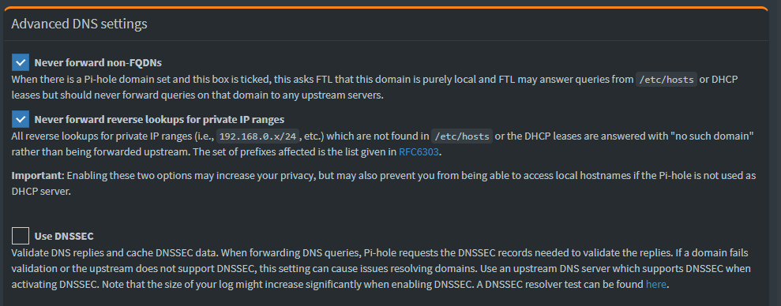

# Open Source Ad-blocking, Secure, Recursive DNS System
Secure (DNS-over-TLS) Adblocking (Pi-hole) Recursive (unbound) Server System setup

I would like to thank rajannpatel (https://github.com/rajannpatel) for posting his repo about this topic. His guide helped contribute to my current setup and notes. See his guide at rajannpatel/Pi-Hole-PiVPN-on-Google-Compute-Engine-Free-Tier-with-Full-Tunnel-and-Split-Tunnel-OpenVPN-Configs

AnudeepND has also provided some great sources of information. See https://github.com/anudeepND/pihole-unbound

## Objective

1. Open Source DNS system
2. Pi-hole based adblocking
3. Recursive DNS (see this link: https://www.cloudflare.com/learning/dns/what-is-recursive-dns/)
4. DNS-over-TLS support (specifically for Android)
5. Upload to Github and promote solution for use

## Tasks

* [x] Requirements list
* [x] Dependencies list
* [x] Create install script for Ubuntu and Debian-based distros
* [x] Post initial code with README on Github
* [x] Promote code and ask for contributions or feature requests

## Requirements

1. Pi-Hole with https
2. Let's Encrypt
3. Unbound DNS
4. DNS-over-TLS support using stunnel4
5. Firewall using ufw

## Dependencies

* Pi-hole
* Unbound
* stunnel4
* ufw firewall
* Certbot for Let's Encrypt
* Let's Encrypt certificate

## Install script steps
 Note: Debian-based installer for Ubuntu 20.04 or 20.10

### Update and install software

```bash
sudo apt update
sudo apt -y install unbound stunnel4 ufw software-properties-common dns-root-data
```

### Disable unbound temporarily 
Unbound causes an issue with dnsmasq until it is set up properly

```bash
sudo systemctl disable unbound
sudo systemctl stop unbound
```

### Pi-hole automated install

```bash
curl -sSL https://install.pi-hole.net | bash
```

 * Take default settings unless you would like to tweak it to your preferences.
 * Select standard settings and any upstream DNS servers of choice. These settings will be changed later
 * Select any block lists of choice. These can be modified later. By default I select all block lists available in the installer
 * Make sure to install the web interface. This is useful in changing settings later.

### Reset Pi-hole web password

```bash
pihole -a -p
```

### Install Let's Encrypt certificate

**Note: The following is optional only if https is desired for the Web Interface** 

 Information can be found here: https://letsencrypt.org/getting-started/ and https://certbot.eff.org/

```bash
sudo snap install core; sudo snap refresh core
sudo snap install --classic certbot
sudo ln -s /snap/bin/certbot /usr/bin/certbot

sudo service lighttpd stop
```

Obtain the certificate interactively

```bash
sudo certbot certonly
```

Follow the documentation here to enable https for lighttpd: https://discourse.pi-hole.net/t/enabling-https-for-your-pi-hole-web-interface/5771

```bash 
sudo service lighttpd start
```

## Set up DNS-Over-TLS support using Stunnel4
Note: Setup documentation found at https://mindlesstux.com/2018/12/07/setup-your-own-dns-over-tls/

### Edit /etc/stunnel/dnstls.conf using nano or another text editor.

The file should have the following contents:

```bash
sslVersion = TLSv1.2

chroot = /var/run/stunnel4
setuid = stunnel4
setgid = stunnel4
pid = /stunnel.pid

[dns]
cert = /etc/letsencrypt/live/example.domain.com/fullchain.pem
key = /etc/letsencrypt/live/example.domain.com/privkey.pem
accept = 853
connect = 127.0.0.1:53
#TIMEOUTidle = 1
#TIMEOUTclose = 1
#TIMEOUTbusy = 1
```

### Edit /etc/default/stunnel4. Add the following line:

```bash
Enabled=1
```

### Enable stunnel4 to run on boot

```bash
sudo systemctl enable stunnel4
```

### Start the stunnel4 service

```bash
sudo systemctl start stunnel4
```

### Check the status of stunnel4 when a client tries to connect

```bash
sudo systemctl status stunnel4
``` 
The output should show the service running and clients connecting

### Set up unbound as a recursive, authoritative DNS server
Note: This set up was derived from the site https://calomel.org/unbound_dns.html

```bash
sudo nano /etc/unbound/unbound.conf.d/pi-hole.conf
```

Put the following configurations into pi-hole.conf (source https://github.com/anudeepND/pihole-unbound)

```bash
server:

    # The  verbosity  number, level 0 means no verbosity, only errors.
    # Level 1 gives operational information. Level  2  gives  detailed
    # operational  information. Level 3 gives query level information,
    # output per query.  Level 4 gives  algorithm  level  information.
    # Level 5 logs client identification for cache misses.  Default is
    # level 1.
    verbosity: 0
    
    interface: 127.0.0.1
    port: 5335
    do-ip4: yes
    do-udp: yes
    do-tcp: yes
    
    # May be set to yes if you have IPv6 connectivity
    do-ip6: yes

    # You want to leave this to no unless you have *native* IPv6. With 6to4 and
    # Terredo tunnels your web browser should favor IPv4 for the same reasons
    prefer-ip6: no

    # control which client ips are allowed to make (recursive) queries to this
    # server. Specify classless netblocks with /size and action.  By default
    # everything is refused, except for localhost.  Choose deny (drop message),
    # refuse (polite error reply), allow (recursive ok), allow_snoop (recursive
    # and nonrecursive ok)
    access-control: 127.0.0.0/8 allow
    #access-control: 10.8.0.0/24 allow
    #access-control: 10.16.0.0/24 allow
    #access-control: 192.168.6.0/24 allow
    #access-control: 192.168.8.0/24 allow

    # Use this only when you downloaded the list of primary root servers!
    # Read  the  root  hints from this file. Make sure to 
    # update root.hints evry 5-6 months.
    root-hints: "/usr/share/dns/root.hints"
    
    # Trust glue only if it is within the servers authority
    harden-glue: yes
    
    # Ignore very large queries.
    harden-large-queries: yes
    
    # Require DNSSEC data for trust-anchored zones, if such data is absent, the zone becomes BOGUS
    # If you want to disable DNSSEC, set harden-dnssec stripped: no
    harden-dnssec-stripped: yes
    
    # Number of bytes size to advertise as the EDNS reassembly buffer
    # size. This is the value put into  datagrams over UDP towards
    # peers. The actual buffer size is determined by msg-buffer-size
    # (both for TCP and UDP).
    edns-buffer-size: 1232
    
    # Rotates RRSet order in response (the pseudo-random 
    # number is taken from Ensure privacy of local IP 
    # ranges the query ID, for speed and thread safety).  
    # private-address: 192.168.0.0/16
    rrset-roundrobin: yes
    
    # Time to live minimum for RRsets and messages in the cache. If the minimum
    # kicks in, the data is cached for longer than the domain owner intended,
    # and thus less queries are made to look up the data. Zero makes sure the
    # data in the cache is as the domain owner intended, higher values,
    # especially more than an hour or so, can lead to trouble as the data in
    # the cache does not match up with the actual data anymore
    cache-min-ttl: 300
    cache-max-ttl: 86400
    
    # Have unbound attempt to serve old responses from cache with a TTL of 0 in
    # the response without waiting for the actual resolution to finish. The
    # actual resolution answer ends up in the cache later on. 
    serve-expired: yes
    
    # Harden against algorithm downgrade when multiple algorithms are
    # advertised in the DS record.
    harden-algo-downgrade: yes
    
    # Ignore very small EDNS buffer sizes from queries.
    harden-short-bufsize: yes
    
    # Refuse id.server and hostname.bind queries
    hide-identity: yes
    
    # Report this identity rather than the hostname of the server.
    identity: "Server"
    
    # Refuse version.server and version.bind queries
    hide-version: yes
    
    # Prevent the unbound server from forking into the background as a daemon
    do-daemonize: no
    
    # Number  of  bytes size of the aggressive negative cache.
    neg-cache-size: 4M
    
    # Send minimum amount of information to upstream servers to enhance privacy
    qname-minimisation: yes
    
    # Deny queries of type ANY with an empty response.
    # Works only on version 1.8 and above
    deny-any: yes

    # Do no insert authority/additional sections into response messages when
    # those sections are not required. This reduces response size
    # significantly, and may avoid TCP fallback for some responses. This may
    # cause a slight speedup
    minimal-responses: yes
    
    # Perform prefetching of close to expired message cache entries
    # This only applies to domains that have been frequently queried
    # This flag updates the cached domains
    prefetch: yes
    
    # Fetch the DNSKEYs earlier in the validation process, when a DS record is
    # encountered. This lowers the latency of requests at the expense of little
    # more CPU usage.
    prefetch-key: yes
    
    # One thread should be sufficient, can be increased on beefy machines. In reality for 
    # most users running on small networks or on a single machine, it should be unnecessary
    # to seek performance enhancement by increasing num-threads above 1.
    num-threads: 1

    # more cache memory. rrset-cache-size should twice what msg-cache-size is.
    msg-cache-size: 50m
    rrset-cache-size: 100m
   
    # Faster UDP with multithreading (only on Linux).
    so-reuseport: yes
    
    # Ensure kernel buffer is large enough to not lose messages in traffix spikes
    so-rcvbuf: 4m
    so-sndbuf: 4m
    
    # Set the total number of unwanted replies to keep track of in every thread.
    # When it reaches the threshold, a defensive action of clearing the rrset
    # and message caches is taken, hopefully flushing away any poison.
    # Unbound suggests a value of 10 million.
    unwanted-reply-threshold: 100000
    
    # Minimize logs
    # Do not print one line per query to the log
    log-queries: no
    # Do not print one line per reply to the log
    log-replies: no
    # Do not print log lines that say why queries return SERVFAIL to clients
    log-servfail: no
    # Do not print log lines to inform about local zone actions
    log-local-actions: no
    # If no logfile is specified, syslog is used
    logfile: "/var/log/unbound/unbound.log"
    
    # Ensure privacy of local IP ranges
    private-address: 192.168.0.0/16
    private-address: 169.254.0.0/16
    private-address: 172.16.0.0/12
    private-address: 10.0.0.0/8
    private-address: fd00::/8
    private-address: fe80::/10

    # Allow the domain (and its subdomains) to contain private addresses.
    # local-data statements are allowed to contain private addresses too.
    #private-domain: "localnetwork.local"


    # locally served zones can be configured for the machines on the LAN.
    #local-zone: "localnetwork.local" static
```

### Check the unbound config file for errors
Note: This is optional. 

```bash
unbound-checkconf /etc/unbound/unbound.conf.d/pi-hole.conf
```

### Enable the unbound and start system service
```bash
sudo systemctl enable unbound
sudo systemctl start unbound
```
### Check the status of the unbound service and make sure everything started okay

```bash
sudo systemctl status unbound
```

### Check whether the domain is resolving and unbound is working. 
The first query will be slow but the subsequent queries will resolve under 1ms.
```
dig github.com @127.0.0.1 -p 5335
```

### Test DNSSEC validation
The first command should give a status report of SERVFAIL and no IP address. The second should give NOERROR plus an IP address.

```bash
dig sigfail.verteiltesysteme.net @127.0.0.1 -p 5335
dig sigok.verteiltesysteme.net @127.0.0.1 -p 5335
```

## Install Nginx
**Note: Add this next part if you want to enable HTTPS connection to Pi-Hole Web UI**

```bash
sudo apt install nginx
sudo nano /etc/nginx/sites-available/pihole-redirect
```

### Edit /etc/nginx/sites-available/pihole-redirect using nano or another text editor.

The file should have the following contents:

```bash
server {
  listen 444 ssl;
  server_name example.domain.com;

 #SSL
  ssl_certificate /etc/letsencrypt/live/example.domain.com/fullchain.pem;
  ssl_certificate_key /etc/letsencrypt/live/example.domain.com/privkey.pem;

  # Deny access to root
  location / {
      autoindex off;
      deny all;
  }

   location /admin {
   rewrite /(.*) /$1 break;
   proxy_pass http://127.0.0.1:80/admin/;
   proxy_set_header Host $host;
   proxy_set_header X-Real-IP $remote_addr;
   proxy_set_header X-Forwarded-For $proxy_add_x_forwarded_for;
   proxy_read_timeout 90;
  }
}
```

### Enable the sites in Nginx and restart service

```bash
sudo rm -rf /etc/nginx/sites-enabled/*
sudo ln -s /etc/nginx/sites-available/pihole-redirect /etc/nginx/sites-enabled/pihole-redirect
sudo service nginx restart
```

## Important Steps:

In order to experience high speed and low latency DNS resolution, you need to make some changes to your Pi-hole. These configurations are crucial because if you skip these steps you may experience very slow response times:

1. Open the configuration file `/etc/dnsmasq.d/01-pihole.conf` and make sure that cache size is zero by setting `cache-size=0`. This step is important because the caching is already handled by the Unbound. **Please note that the changes made to this file will be overwritten once you update/modify Pi-hole.**

2. When you're using unbound you're relying on that for DNSSEC validation and caching, and Pi-hole doing those same things are just going to waste time validating DNSSEC twice. In order to resolve this issue you need to untick the `Use DNSSEC` option in Pi-hole web interface by navigating to `Settings > DNS > Advanced DNS settings`.  



## Final Steps:

Next steps to set Pi-hole's upstream DNS server to the unbound service

1. Log into Pi-hole web interface
2. Go to Settings --> DNS
3. Set the Upstream DNS Servers to the locahost instance of unbound and deselect all other upstream servers
   


4. Reboot Server to Apply all changes and check configuration