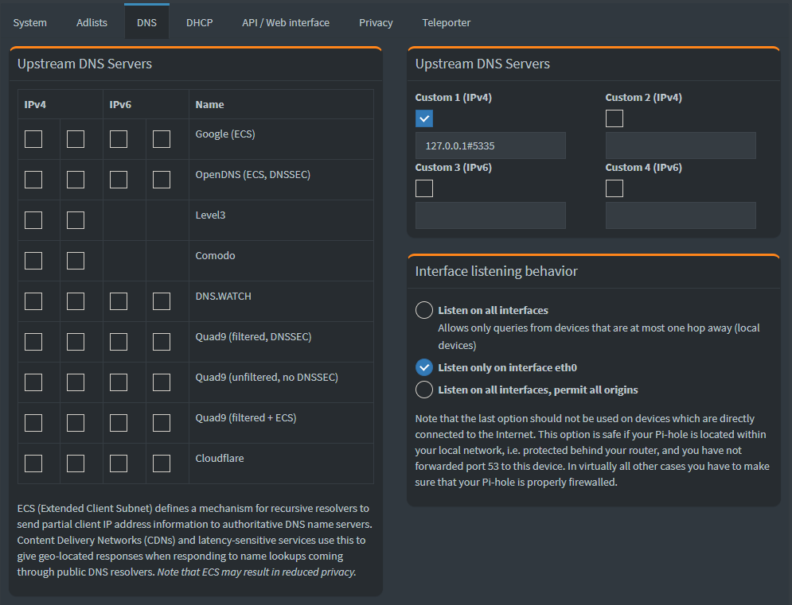

# Edit on 12/15/2020 - I just discovered Technitium DNS Server found here: https://github.com/TechnitiumSoftware/DnsServer
## Potential advantages over Pi-Hole:
* Authoritative and recursive DNS server by default
* No need to install Unbound or stunnel4

## Potential disadvantages compared to Pi-Hole:
* Newer project ("shiny")
* Less active community
* Only two contributors on Github.

## I'll be testing Technitium and comparing it to Pi-Hole to determine reliability comparison.
Quick review on 1/5/2021: The system works well and is much easier to set up. Within an hr I had a Google Compute VM up and running with the server, configured proper firewall rules, install UFW firewall, enabled Letsencrypt and turned on DNS-over-TLS with the same adlists I was using on my Pi-Hole servers. This seems to be a more streamlined option over the original system I put together.

# Open Source Ad-blocking, Secure, Recursive DNS System
Secure (DNS-over-TLS) Adblocking (Pi-hole) Recursive (unbound) Server System setup

I would like to thank rajannpatel (https://github.com/rajannpatel) for posting his repo about this topic. His guide helped contribute to my current setup and notes. See his guide at rajannpatel/Pi-Hole-PiVPN-on-Google-Compute-Engine-Free-Tier-with-Full-Tunnel-and-Split-Tunnel-OpenVPN-Configs

## Objective

1. Open Source DNS system
2. Pi-hole based adblocking
3. Recursive DNS (see this link: https://www.cloudflare.com/learning/dns/what-is-recursive-dns/)
4. DNS-over-TLS support (specifically for Android)
5. Upload to Github and promote solution for use

## Tasks

* [x] Requirements list
* [x] Dependencies list
* [ ] Create system diagram
* [x] Create install script for Ubuntu and Debian-based distros
* [x] Post initial code with README on Github
* [x] Promote code and ask for contributions or feature requests

## Requirements

1. Pi-Hole with https
2. Let's Encrypt
3. Unbound DNS
4. DNS-over-TLS support using stunnel4
5. Firewall using ufw
6. Dynamic DNS support

## Dependencies

* Pi-hole
* Unbound
* stunnel4
* ufw firewall
* ddclient
* Certbot for Let's Encrypt
* Let's Encrypt certificate

## Install script steps

```bash
# Debian-based installer for Ubuntu 18.04
sudo apt update
sudo apt -y install unbound stunnel4 ufw ddclient software-properties-common

# Disable unbound temporarily as it causes an issue with dnsmasq until it is set up properly
sudo systemctl disable unbound
sudo systemctl stop unbound

# Pi-hole automated install
curl -sSL https://install.pi-hole.net | bash
# 1. Take default settings unless you would like to tweak it to your preferences.
# 2. Select standard settings and any upstream DNS servers of choice. These settings will be changed later
# 3. Select any block lists of choice. These can be modified later. By default I select all block lists
 available in the installer
# 4. Make sure to install the web interface. This is useful in changing settings later.

# Reset Pi-hole web password
pihole -a -p

#################################################################################################
# The following is optional only if https is desired for the Web Interface
#
#
# Install Let's Encrypt certificate
# Information can be found here: https://letsencrypt.org/getting-started/ and https://certbot.eff.org/
sudo add-apt-repository universe
sudo add-apt-repository -y ppa:certbot/certbot
sudo apt update
sudo apt -y install certbot
#
# Obtain the certificate interactively
sudo certbot certonly
#
# Follow the documentation here to enable https for lighttpd: https://discourse.pi-hole.net/t/enabling-https-for-your-pi-hole-web-interface/5771

#################################################################################################

# Set up DNS-Over-TLS support using Stunnel4
# Setup documentation found at https://mindlesstux.com/2018/12/07/setup-your-own-dns-over-tls/

# Edit /etc/stunnel/dnstls.conf using nano or another text editor.
# The file should have the following contents:

sslVersion = TLSv1.2

chroot = /var/run/stunnel4
setuid = stunnel4
setgid = stunnel4
pid = /stunnel.pid

[dns]
cert = /etc/letsencrypt/live/vps.clayauld.com/fullchain.pem
key = /etc/letsencrypt/live/vps.clayauld.com/privkey.pem
accept = 853
connect = 127.0.0.1:53
#TIMEOUTidle = 1
#TIMEOUTclose = 1
#TIMEOUTbusy = 1

# This is the end of the file

# Edit /etc/default/stunnel4. Find the following line:
Enabled=0
# Set the line to the following and close the editor:
Enabled=1

# Enable stunnel4 to run on boot
sudo systemctl enable stunnel4
# Start the stunnel4 service
sudo systemctl start stunnel4

# Check the status of stunnel4 when a client tries to connect
sudo systemctl status stunnel4
# The output should show the service running and clients connecting


# Set up unbound as a recursive, authoritative DNS server
# This set up was derived from the site https://calomel.org/unbound_dns.html
sudo nano /etc/unbound/unbound.conf.d/pi-hole.conf

# Put the following configurations into pi-hole.conf
server:
    # If no logfile is specified, syslog is used
    logfile: "/var/log/unbound/unbound.log"
    verbosity: 5

    interface: 127.0.0.1

    port: 5353
    do-ip4: yes
    do-udp: yes
    do-tcp: yes

    # May be set to yes if you have IPv6 connectivity
    do-ip6: yes

    # control which client ips are allowed to make (recursive) queries to this
    # server. Specify classless netblocks with /size and action.  By default
    # everything is refused, except for localhost.  Choose deny (drop message),
    # refuse (polite error reply), allow (recursive ok), allow_snoop (recursive
    # and nonrecursive ok)
    access-control: 127.0.0.0/8 allow
    #access-control: 10.8.0.0/24 allow
    #access-control: 10.16.0.0/24 allow
    #access-control: 192.168.6.0/24 allow
    #access-control: 192.168.8.0/24 allow

    # Use this only when you downloaded the list of primary root servers!
    root-hints: "/var/lib/unbound/root.hints"

    # enable to not answer id.server and hostname.bind queries.
    hide-identity: yes

    # enable to not answer version.server and version.bind queries.
    hide-version: yes

    # Trust glue only if it is within the servers authority
    harden-glue: yes

    # Require DNSSEC data for trust-anchored zones, if such data is absent, the zone becomes BOGUS
    harden-dnssec-stripped: yes

    # Don't use Capitalization randomization as it known to cause DNSSEC issues sometimes
    # see https://discourse.pi-hole.net/t/unbound-stubby-or-dnscrypt-proxy/9378 for further details
    #use-caps-for-id: no

    # Use 0x20-encoded random bits in the query to foil spoof attempts.
    # http://tools.ietf.org/html/draft-vixie-dnsext-dns0x20-00
    # While upper and lower case letters are allowed in domain names, no significance
    # is attached to the case. That is, two names with the same spelling but
    # different case are to be treated as if identical. This means calomel.org is the
    # same as CaLoMeL.Org which is the same as CALOMEL.ORG.
    use-caps-for-id: yes

    # Reduce EDNS reassembly buffer size.
    # Suggested by the unbound man page to reduce fragmentation reassembly problems
    edns-buffer-size: 1472

    # TTL bounds for cache
    cache-min-ttl: 3600
    cache-max-ttl: 86400

    # Perform prefetching of close to expired message cache entries
    # This only applies to domains that have been frequently queried
    prefetch: yes

    # One thread should be sufficient, can be increased on beefy machines
    num-threads: 1

    # Ensure kernel buffer is large enough to not loose messages in traffic spikes
    so-rcvbuf: 1m

    # Ensure privacy of local IP ranges
    private-address: 192.168.0.0/16
    private-address: 169.254.0.0/16
    private-address: 172.16.0.0/12
    private-address: 10.0.0.0/8
    private-address: fd00::/8
    private-address: fe80::/10

    # Allow the domain (and its subdomains) to contain private addresses.
    # local-data statements are allowed to contain private addresses too.
    #private-domain: "localnetwork.local"


    # locally served zones can be configured for the machines on the LAN.
    #local-zone: "localnetwork.local" static


# This is the end of pi-hole.conf

# Download a copy of the root hints from Internic
sudo wget https://www.internic.net/domain/named.root -O /var/lib/unbound/root.hints

# Enable the unbound system service
sudo systemctl enable unbound
# Start the unbound service
sudo systemctl start unbound
# Check the status of the unbound service and make sure everything started okay
sudo systemctl status unbound
```

Next steps to set Pi-hole's upstream DNS server to the unbound service

1. Log into Pi-hole web interface
2. Go to Settings --> DNS
3. Set the Upstream DNS Servers to the locahost instance of unbound and deselect all other upstream servers
   


4. Enable DNSSEC on Pi-hole service


5. Reboot Server to Apply all changes and check configuration
